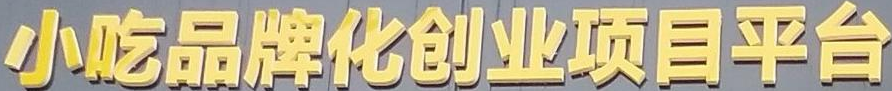
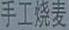

## OCRInternVL2

OCR Large Multi-model Model，基于Internvl2微调OCR的多模态大模型，在4张A800上基于internvl2-8b模型微调。internvl2-8b在我们自测的ocr的vqa场景效果表现很好，我们再使用ocr数据微调之后，对于一般的ocr的vqa任务都能实现很好的效果。非常详细的介绍在博客中：https://blog.csdn.net/u012193416/article/details/142714091

 <p align="center">
      <a href='https://github.com/leeguandong/OCRInternVL2'>
            
      </a>
      </br>
      <a href="https://github.com/leeguandong/OCRInternVL2/graphs/contributors">
        
      </a>
      <a href="https://github.com/leeguandong/OCRInternVL2/issues">
        
      </a>
      <a href="https://github.com/leeguandong/OCRInternVL2/pulls">
        
      </a>
      <a href=href="https://github.com/leeguandong/OCRInternVL2/stargazers">
        
      </a>
      <a href=href="https://github.com/leeguandong/OCRInternVL2">
        
      </a>
      </br>
      <a href=href="https://github.com/leeguandong/OCRInternVL2">
        
      </a>
      <a href=href="https://github.com/leeguandong/OCRInternVL2">
        
      </a>
      <a href="https://github.com/leeguandong/OCRInternVL2/blob/main/LICENSE">
        
      </a>
  </p>

## 本文贡献

- 借助OCR开源数据集，基于internvl2训练微调，并开放了用于学术研究的训练lora权重，推理时需要自行加载原始的internvl2-8b权重，可借助tools/swift_infer_merge_lora.sh进行权重合并。
## 数据集

- [ESTVQA](https://github.com/xinke-wang/EST-VQA)是一个基于事实场景文本VQA，包括709张图片和相应的query-answer。
- [ReCTS](https://rrc.cvc.uab.es/?ch=12)是文字识别数据集，包括2701张图片和相应的query-answer。
- [RCTW17](https://rctw.vlrlab.net/dataset)是中文场景文本数据集，包括1000张图片和相应的query-answer。

在上述工作中，报告信息都为非结构化的，不利于科学研究。我们对两个数据集进行了预处理，并最终得到了可以用于训练的数据。
|数据集|数量|下载链接|质量|
|:-|:-|:-|:-|
|OCR-data|3710|[ocr数据](./data/EcommerceOCRBench/ESTVQA_cn_rectw17_ocr_swift.jsonl)、[ocr图像](./data/EcommerceOCRBench/data/)|低|


## 快速上手

### 1.安装环境
```bash
# Full capabilities
pip install 'ms-swift[all]' -U
# LLM only
pip install 'ms-swift[llm]' -U
# AIGC only
pip install 'ms-swift[aigc]' -U
# Adapters only
pip install ms-swift -U
```
### 2.模型推理

|模型权重|下载链接|质量|微调方法|
|:-|:-|:-|:-|
|checkpoints-OCRInternVL2-570|results/internvl2_swift_ocr/internvl2-8b/v2-20241004-142408/checkpoint-570/|低|LoRA|

#### CLI推理

```python
CUDA_VISIBLE_DEVICES=7 swift export \
  --ckpt_dir "/home/lgd/e_commerce_lmm/results/internvl2_swift_ocr/internvl2-8b/v2-20241004-142408/checkpoint-570/" \
  --merge_lora true

CUDA_VISIBLE_DEVICES=7 swift infer \
    --ckpt_dir "/home/lgd/e_commerce_lmm/results/internvl2_swift_ocr/internvl2-8b/v2-20241004-142408/checkpoint-570-merged/" \
    --load_dataset_config true
```
### 3.模型训练（复现OCRInternVL2）

<details>
  <summary>硬件资源</summary>
  <p>* 实验在A800 (4X, 80GB)上进行</p>
</details>
- （1）准备[ocr数据](./data/EcommerceOCRBench/ESTVQA_cn_rectw17_ocr_swift.jsonl)和[ocr图像](./data/EcommerceOCRBench/data/);
- （2）开始训练：

```bash
swift_finetune_internvl_lora.sh
```
这里的复现过程非常简单，主要是很多过程我们都为大家准备好了，大家可以随时复现一个自己的`OCRInternVL2`。

## 效果展示

*以下效果来自于**低质量**的数据训练和权重

影像诊断：
|ocr图像|label|OCRInternVL2|
|:-|:-|--|
||小吃品牌化创业项目平台|小吃品牌化创业项目平台|
||手工烧麦|手工烧麦|

## 项目致谢

1. [SWIFT](https://github.com/modelscope/swift)为我们提供了训练框架；

## 免责声明

本项目相关资源仅供学术研究之用，严禁用于商业用途。使用涉及第三方代码的部分时，请严格遵循相应的开源协议。

## 使用许可

此存储库遵循[CC BY-NC-SA](https://creativecommons.org/licenses/by-nc-sa/4.0/) ，请参阅许可条款。

## Star History

<a href="https://star-history.com/#leeguandong/OCRInternVL2&Date">

  <picture>
    <source media="(prefers-color-scheme: dark)" srcset="https://api.star-history.com/svg?repos=leeguandong/OCRInternVL2&type=Date&theme=dark" />
    <source media="(prefers-color-scheme: light)" srcset="https://api.star-history.com/svg?repos=leeguandong/OCRInternVL2&type=Date" />
    
  </picture>

</a>
